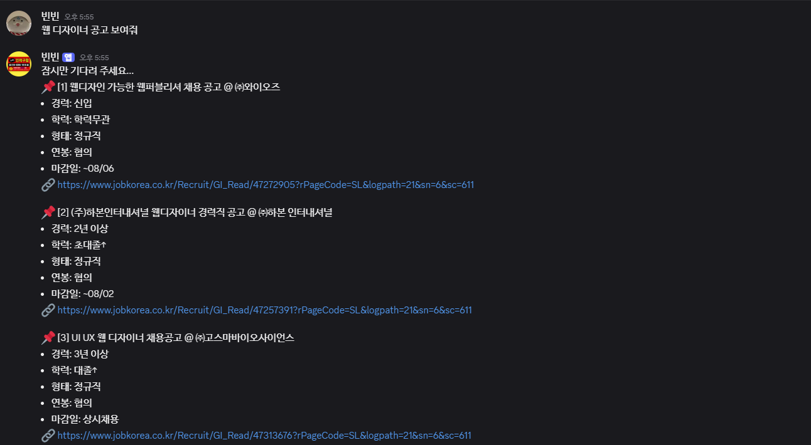
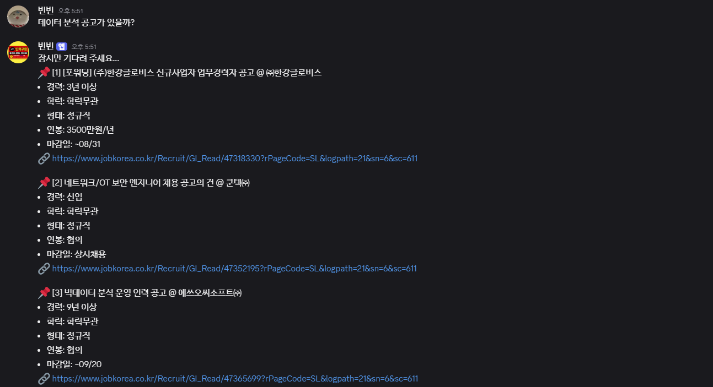

# 채용 공고 검색 디스코드 봇

> 취업 준비생이 자연어로 채용 공고를 검색하고, 관심 조건에 맞는 신규 공고를 자동 알림받는 end-to-end 데이터 파이프라인

<div align="center">
  
  
</div>

---

## 1. 개요

| 항목 | 내용 |
|------|------|
| 개발 기간 | 2025.06 ~ 2026.03 |
| 운영 환경 | Mac Mini M4 32GB (홈 서버) |
| 수집 규모 | 누적 약 18만 건 (유효 공고 약 3만 건) |
| LLM | EXAONE 3.5 7.8B via Ollama (LAN 원격 실행) |
| 인터페이스 | Discord Bot |

### 개발 배경
취업 준비 중 채용 사이트를 매번 직접 검색하는 방식이 번거롭다고 느꼈습니다.
"서울 백엔드 신입 정규직 공고 보여줘"처럼 자연어로 물어보면 바로 결과를 주는 검색 도구를 만들고 싶었고,
단순 기능 구현에서 나아가 LLM을 활용한 검색 품질 개선까지 단계적으로 발전시켰습니다.

---

## 2. 시스템 아키텍처

### 전체 구조

```
[잡코리아]
    │ Playwright 크롤링 (매일 06:00, cron)
    │ 5페이지마다 batch_to_db() 직접 적재
    ▼
[EXAONE 3.5 7.8B via Ollama]  ← 공고 시맨틱 태그 자동 생성 (방안 3)
    ▼
[PostgreSQL]
  ├─ recruits / companies / tags / regions
  ├─ user_profiles / user_subscriptions
  ├─ notification_log / data_quality_log
    │
    └─ [Discord Bot]
         ├─ 자연어 검색
         │    extract_filters() → 키워드 확장 → SQL → 재순위 → 결과 반환
         └─ 구독 알림 (24h)
              키워드 확장 → 매칭 → 재순위 → DM 발송
```

### ETL 파이프라인

```
Extract              Transform                      Load
크롤링          →    JobPreprocessor           →    PostgreSQL
(Playwright)         · 경력/학력/형태 인코딩         (batch_to_db, 5페이지 단위)
                     · 마감일 파싱                   · ON CONFLICT DO NOTHING
                     · 월급 → 연봉 환산              · LLM 시맨틱 태깅 (방안 3)
                     · 태그 동의어 정규화
                     · 연봉 이상값 검증 + 이력 기록
```

### DB 스키마

```
regions ──< subregions ──< recruits >── companies
                               │
                          recruit_tags
                               │
                             tags  ← LLM 생성 시맨틱 태그 포함
```

- `recruits`: 채용 공고 (경력·학력·형태는 Integer 코드로 저장)
- `companies`, `regions`, `subregions`: 정규화 분리
- `tags`: 크롤링 태그 + EXAONE 생성 시맨틱 태그 (M:N 관계)
- 중복 방지: `UNIQUE(company_id, announcement_name, deadline)`

### 검색 흐름

```
사용자 입력: "서울 프론트 엔지니어 신입 공고"
        │
        ▼
extract_filters()           정규식 기반 파싱 (ms 단위)
  { region: "서울", keyword: "프론트엔드", max_experience: 0 }
        │
        ▼ (방안 1)
expand_keyword()            EXAONE LLM 키워드 확장
  ["프론트엔드", "frontend", "React", "Vue", "UI개발", ...]
        │
        ▼
search_recruits_by_filter() 확장 키워드 OR 매칭으로 후보 50건 검색
        │
        ▼ (방안 2)
rerank()                    EXAONE LLM 관련도 재순위
        │
        ▼
Discord 메시지 반환 (상위 5건)
```

---

## 3. 핵심 구현

### 3-1. JobPreprocessor — 원시 데이터 정형화

크롤링 텍스트를 DB 적재 가능한 정형 데이터로 변환합니다.

| 원시 데이터 | 변환 결과 | 처리 방식 |
|-------------|-----------|-----------|
| `"경력 3년 이상"` | `3` | 정규식 숫자 추출 |
| `"대졸↑"` | `3` | 학력 레벨 매핑 |
| `"정규직"` | `1` | 고용형태 코드 매핑 |
| `"~06/10(화)"` | `date(2025, 6, 10)` | 정규식 날짜 파싱 |
| `"상시채용"` | `date(9999, 12, 31)` | Sentinel value |
| `"월 300만원"` | `3600` | 월급 → 연봉 환산 |
| `"AI, 백엔드, ..."` | `["AI", "백엔드"]` | 쉼표 분리 |

`parse_*` (문자열 → 숫자/날짜) / `stringify_*` (숫자 → 표시 문자열) 대칭 구조로
저장과 표시 로직을 분리했습니다.

### 3-2. 멱등성 보장 — 중복 없는 적재

크롤러 재실행 시 DB에 중복이 쌓이지 않도록 `ON CONFLICT DO NOTHING` 패턴을 사용했습니다.

```sql
INSERT INTO recruits (company_id, announcement_name, deadline, ...)
VALUES (...)
ON CONFLICT (company_id, announcement_name, deadline) DO NOTHING;
```

`companies`, `subregions`, `tags` 등 모든 참조 테이블에 동일 패턴 적용.
신규 삽입된 공고는 `RETURNING id`로 ID를 받아 LLM 태깅 대상으로 연결합니다.

### 3-3. 자연어 검색 — 정규식 필터 추출

```
입력: "서울 신입 백엔드 정규직 연봉 4000 이상 공고"
출력: { "keyword": "백엔드", "region": "서울",
        "max_experience": 0, "form": "정규직",
        "min_annual_salary": 4000 }
```

LLM 기반 추출(Mistral 7B → Gemma3:4b)에서 정규식 기반으로 전환하여 응답 속도를 **수 초 → 밀리초**로 개선했습니다. (상세: [TROUBLE_SHOOT.md #8](./TROUBLE_SHOOT.md))

### 3-4. LLM 검색 품질 개선 3단계

기준선 측정(testset 100건): Hit@5=52%, Hit@10=58%, MRR=0.394, Zero-result=3%

**방안 1 — 구독 키워드 확장** (`discord_bot/keyword_expander.py`)

EXAONE에게 구독 키워드의 동의어·기술 스택을 생성하게 하여 OR 매칭으로 recall을 높입니다.

```
"ML엔지니어" → ["ML엔지니어", "MLOps", "머신러닝엔지니어", "딥러닝", "PyTorch", ...]
```

프롬프트에 "상위 개념 금지", 나쁜 예시 추가로 과확장을 억제했습니다.

→ **구독 매칭 건수 +30%** (V1 프롬프트 +86% → V2 프롬프트 +30%)

**방안 2 — 알림/검색 재순위** (`discord_bot/reranker.py`)

발송 전 10건을 배치로 LLM에 전달하여 관련도 0~10점으로 평가, 점수 순 재정렬합니다.

→ **Precision@10: 45.0% → 64.0% (+19.0%p)**

**방안 3 — LLM 시맨틱 태깅** (`db/tagger.py`)

크롤링 시 공고명·기존 태그를 EXAONE에 전달하여 직무·기술 태그를 자동 생성합니다.
공고명에 없는 키워드로도 검색 가능해집니다.

```
공고명: "AI 연구원 채용"
생성 태그: 머신러닝, 딥러닝, PyTorch, 모델학습, NLP, 컴퓨터비전
```

→ **동의어 쿼리 Recall@10: 37.8% → 88.9% (+51.1%p)**

모델 선정 과정: gemma3:4b, qwen2.5:7b, exaone3.5:7.8b 비교 후 한국어 태깅 품질과 지시 준수 안정성이 가장 우수한 exaone3.5:7.8b 선택.

### 3-5. 운영 환경

- **서버**: Mac Mini M4 32GB 홈 서버
- **Ollama**: LAN 내 Mac에서 `OLLAMA_HOST=0.0.0.0`으로 실행, 같은 네트워크의 서버에서 원격 호출
- **ETL 자동화**: cron job 매일 06:00 실행 + LLM 태깅 자동 적용
- **수집 규모**: 누적 약 18만 건 (유효 공고 약 3만 건)

---

## 4. 데이터 수집 현황

| 기간 | 일별 수집량 | 비고 |
|------|------------|------|
| 평일 | ~6,400건 / 일 | 50건/페이지 × 약 128페이지 |
| 주말 | ~740건 / 일 | 공고 게재량 감소 |
| 누적 (2025.06~2026.03) | 약 18만 건 | 유효 공고(마감 미도래) 약 3만 건 |

---

## 5. 트러블슈팅

주요 이슈 25건은 [TROUBLE_SHOOT.md](./TROUBLE_SHOOT.md)에 상세히 기록했습니다.
여기서는 핵심 의사결정 관련 항목만 요약합니다.

### 5-1. 크롤링 차단 (BeautifulSoup → Selenium → Playwright)

잡코리아의 봇 탐지를 우회하기 위해 최종적으로 Playwright를 선택했습니다.
랜덤 UA·sleep·periodic rest를 추가해 탐지 가능성을 낮췄습니다.

### 5-2. 검색 방식 전환 (FAISS → SQL)

FAISS + KR-SBERT 도입 후 운영하며 구조적 한계를 확인했습니다.
임베딩 대상이 공고명 하나뿐이고, 핵심 조건(연봉·경력·지역)이 정형 데이터여서
벡터 거리보다 SQL WHERE 절이 더 정확했습니다. 730MB 메모리 점유도 제거됐습니다.

### 5-3. LLM 필터 추출 → 정규식 전환

LLM 추출 조건들이 대부분 정형 패턴임을 분석 후, 정규식으로 교체하여
응답 속도를 수 초 → 밀리초로 단축하고 Ollama 의존성을 제거했습니다.

### 5-4. LLM 키워드 과확장 억제

방안 1 초기 구현 시 프롬프트가 "관련 키워드"를 요청하여 상위 개념까지 포함,
매칭 건수가 +86% 폭증했습니다. "동의어·기술 스택만, 상위 개념 금지 + 나쁜 예시" 프롬프트로
+30%로 조정하여 recall과 precision을 균형 있게 유지했습니다.

---

## 6. 회고

### 잘 된 점

- 크롤링 → 정제 → 저장 → 검색 → 알림까지 전 과정을 직접 구축하며 데이터 엔지니어링 실전 경험을 쌓았습니다.
- 단순 기능 구현에서 멈추지 않고 testset 기반 품질 지표를 설정하고, LLM을 통해 수치로 개선을 증명하는 과정을 거쳤습니다.
- 과확장 억제, 모델 비교 선정, testset 편향 발견 등 예상치 못한 문제를 직접 마주하고 해결했습니다.

### 아쉬운 점

**엔지니어링 성숙도**
초기 구현 시 행마다 DB 연결 생성, FAISS 매 검색마다 디스크 로드, CSV 중간 허브 구조 등 미흡한 부분이 있었습니다. 이후 Connection Pool, 모듈 캐싱, 직접 적재로 순차 개선했습니다. 처음부터 설계했다면 피할 수 있었을 비효율들이었습니다.

**testset 편향**
방안 3 평가 시 Before/After가 동일하게 나와 원인을 분석하니, testset 쿼리가 공고명 기반으로 생성되어 태그 추가 효과를 측정하지 못하는 구조였습니다. 평가 설계의 중요성을 배웠고, 동의어 기반 별도 평가로 실제 효과를 측정했습니다.

**운영 모니터링**
ETL 실패 시 알림이 없어 수동으로 확인해야 하는 구조입니다.

---

## 7. 개선 방향

| 한계 | 개선 방향 | 상태 |
|------|----------|------|
| CSV 경유 파이프라인 | 크롤러 → DB 직접 적재 | ✅ 완료 |
| 행마다 DB 연결 생성 | Connection Pool 도입 | ✅ 완료 |
| FAISS 벡터 검색 한계 | LLM 필터 추출 + SQL | ✅ 완료 |
| LLM 필터 추출 오버엔지니어링 | 정규식 기반 교체 | ✅ 완료 |
| 구독 알림 recall 부족 | 키워드 확장 (방안 1) | ✅ 완료 |
| 구독 알림 관련도 낮음 | 재순위 (방안 2) | ✅ 완료 |
| 동의어 검색 불가 | 시맨틱 태깅 (방안 3) | ✅ 완료 |
| 직접 검색에 LLM 미적용 | sql_search에 방안 1·2 통합 | ✅ 완료 |
| ETL 실패 시 알림 없음 | Discord 알림 또는 모니터링 연동 | 🔲 미완료 |

---

## 8. 기술 스택

| 분류 | 기술 |
|------|------|
| 크롤링 | Playwright |
| ETL / 데이터 처리 | Python |
| 정형 DB | PostgreSQL, SQLAlchemy |
| LLM | Ollama, EXAONE 3.5 7.8B |
| 봇 인터페이스 | discord.py |
| 자동화 | cron job |
| 서버 환경 | Mac Mini M4 32GB |
