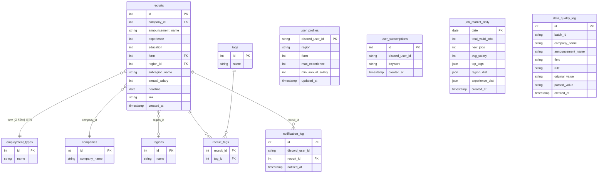

# Job Search Bot
**채용 공고 자동 수집 · 검색 · 알림 시스템**

`Python` `Playwright` `PostgreSQL` `Discord.py` `EXAONE 3.5 7.8B` `Ollama` `Cron`

---

## Overview

잡코리아에서 매일 신규 채용 공고를 자동으로 수집하고, Discord를 통해 자연어로 검색하거나 관심 조건을 구독하면 맞춤 공고를 DM으로 자동 알림하는 end-to-end 데이터 파이프라인을 설계·구현했습니다. EXPLAIN ANALYZE 실측(50개 키워드 기준)으로 ILIKE 검색 병목을 단계별로 진단하고 인덱스 3개를 순차 적용해 공고명 검색 평균 80.9배·태그 검색 약 650배(2,869ms → 4ms) 개선을 달성했습니다. 사용자의 검색 쿼리 및 DB의 공고 태그를 LLM 기반으로 보강하고, TREC-style 평가 프레임워크로 검색 품질을 정량 측정했습니다.

"매일 직접 채용 사이트를 열람하는 것이 비효율적이다"라는 불편함에서 시작했으며, 단순 알림 봇 구현에서 멈추지 않고 아래의 기술적 목표를 직접 경험하는 것이 목적이었습니다.

1. ETL 파이프라인 설계
크롤링(추출) → 정제 → 적재 전 과정 직접 구현
2. 검색 품질 측정과 한계 진단
TREC-style 평가 프레임워크를 직접 설계해 LLM 기반 후보 재순위·태그 검색·쿼리 확장의 모드를 정량적으로 비교
측정 결과로부터 개선이 미미한 원인을 원천 데이터의 품질(공고 제목·저품질 태그만 보유)로 진단

---

## Architecture & Flow

---
Layer                 Component                 Role
Ingestion             Scraper (Playwright)      매일 06:00 잡코리아 동적 페이지 헤드리스 크롤링
Data Cleansing        JobPreprocessor           경력·연봉·고용형태·지역 정규화 및 이상값 검증
Data Enrichment       EXAONE 3.5 7.8B (Ollama)  데이터 수집 시 기존 공고명 및 크롤링 태그 기반 추가 시맨틱 태그 자동 보강
                                                데이터 검색 시 사용자 쿼리 키워드 확장 · 결과 후보 재순위
Data Saving           PostgreSQL                공고·태그·기업·지역 정규화 4개 테이블, trigram 인덱스
Data Analysis         Market Snapshot           유효 공고(마감일 내) 기준 인기 태그·연봉·지역·경력 분포 일별 집계
Service               Discord Bot               자연어 검색, 구독 등록, 24h 주기 신규 공고 DM 알림
## Database Schema

## Implemented

Implemented
Data Ingestion & Cleansing
- Playwright 기반 동적 페이지 크롤링
- 경력·연봉·학력·고용형태·지역·마감일 6개 필드를 숫자 코드로 정규화해 조건 기반 필터링 
- 수집 시점에 범위 기반 유효성 검사로 이상값을 차단
Data Enrichment (LLM)
- 크롤링 시 공고명 기반으로 직무·기술 시맨틱 태그 자동 생성해 색인 보강 (수집 레이어)
- 검색 후보를 LLM이 관련도 순으로 재정렬 (검색 시 레이어)
- 사용자 쿼리 기반 복합 조건(AND) 검색 결과 부족 시 자동 OR 폴백, 결과 부족 시 LLM 쿼리 확장으로 재검색 (검색 레이어)
Data Saving
- 공고·회사·지역·태그를 정규화 설계, 원본 공고 테이블과 날짜별 시장 집계 테이블 분리
- ILIKE 검색 병목을 EXPLAIN ANALYZE로 단계별 진단, 인덱스 3개 순차 적용
  - 공고명 trigram GIN 인덱스: 50개 키워드 실측 기준 평균 **80.9배** 개선, 최대 **274배** (308ms → 1.1ms). 히트율 높은 키워드는 DB 플래너가 전체 스캔으로 자동 전환 → 성능 저하 없음
  - 태그-공고 연결 테이블에 태그 방향 인덱스 추가: 복합 인덱스가 공고→태그 방향으로만 설계되어 반대 방향에서 110만 건 전체 스캔 발생 → 단독 인덱스 추가로 제거 (2,869ms → 35ms)
  - 태그명 trigram GIN 인덱스: 위 개선 후 드러난 2차 병목 제거 → 최종 **4ms** (약 **650배**)
Data Analysis
- 유효 공고 기준 인기 기술 스택·평균 연봉·지역·경력 분포를 날짜별로 집계해 저장
- Service & Operation
- 지역·고용형태·경력·연봉 등 정형 패턴을 정규식으로 파싱해 SQL로 변환
- 키워드·지역·경력·연봉 조건 등록 시 24시간 주기로 신규 공고를 매칭해 DM 발송
- Cron job 06:00 매일 실행 (크롤링 + LLM 태깅) 분석 스냅샷 자동 연동. 날짜별 로그 파일 분리

## Trouble Shooting

1. FAISS 벡터 검색 제거 → SQL 전환
Problem
초기에 KR-SBERT + FAISS 기반 벡터 검색을 도입했으나 검색 품질이 기대 이하
임베딩 모델과 DB 인덱스가 상시 메모리 점유하여 리소스 부담
Cause
크롤링 공고 설명이 자연어 문단이 아닌 "Python, Django, REST API" 형태의 키워드 목록이라 낮은 시맨틱
임베딩 효과
공고의 상세 페이지를 전부 크롤링 하기에 시간적 비용이 많이 소요 (~10,000 건/일)

Solution
FAISS를 제거하고 PostgreSQL SQL 기반 검색으로 전환 (~730MB 메모리 회수)
지역·경력·연봉·고용형태는 정형 컬럼 WHERE 절로, 직무·기술 키워드는 공고명·태그 ILIKE 검색으로 처리

2. 검색 품질 향상 — LLM 도입, 평가, 한계 진단
Problem
동의어·관련 기술 스택으로 검색 시 관련 공고가 누락 (ex: ‘프론트 엔지니어’ 쿼리로 ‘React’, ‘Vue’ 공고 누락)
매칭된 후보 중 관련도 정렬이 없어 상위 노출 품질이 낮음
Cause
키워드 ILIKE 매칭만으로는 의미적으로 관련된 직무명·기술 스택을 커버할 수 없음
후보 공고를 관련도 순으로 정렬하는 로직 없음
어떤 쿼리에 어떤 공고가 기대 결과인지, 검색 품질 평가 기준(테스트 셋)과 지표가 없었음

Solution
- 정보 검색 표준 평가 방법론인 ‘TREC-style pooling’ 설계 후 평가
- 쿼리 유형 4가지(키워드 직접형·시맨틱형·모호형·엣지케이스)로 43개 쿼리 수작업 설계
- 5가지 모드(baseline / +tags / +rerank / +expanded / +adaptive)를 동시 실행해 후보 풀 수집
- 룰 기반 판정자(직무·지역·고용형태·경력·연봉 기준 0-3점)로 관련도 판정
- NDCG@K, Precision@K, Hit@K로 모드별 성능 비교

모드      설명                                                NDCG@10 vs baseline
baseline  공고명·태그 키워드 AND 매칭, 재순위 없음              0.753   -
rerank    후보 공고를 LLM 관련도 점수로 재정렬                  0.771   +0.017    
tags    크롤링 시 LLM이 생성한 시맨틱 태그도 AND 매칭에 포함     0.657   -0.096      
expanded      쿼리를 항상 LLM으로 확장해 OR 매칭                0.527   -0.137    
adaptive    AND 결과 < 3건일 때만 LLM 확장 OR 매칭으로 fallback 0.667   +0.009    

Limit    
+tags: 멀티토큰 AND 매칭이 과적용되어 결과 0건 케이스 증가, 오히려 성능 저하     
+rerank, +adaptive: baseline 대비 유의미한 차이 없음

근본 원인은 데이터 원천의 품질 한계였습니다. 잡코리아 크롤링 데이터는 공고 제목과 저품질 태그만 제공하므로, 검색 방식을 개선해도 의미 있는 성능 향상이 불가능한 구조였습니다. 공고 상세 페이지는 형식이 제각각인 PDF로 제공되어 대량 수집이 어렵고, 타 채용 플랫폼의 공개 API도 상세 텍스트를 제공하지 않습니다. 결론적으로, 대규모 크롤링 또는 채용사 API 제휴를 통해 고품질 데이터를 확보하지 않는 한 이 접근법은 구조적 한계를 벗어날 수 없다고 판단했습니다.

## Results

Summary
잡코리아 채용 공고 약 18만 건을 자동 수집·정제하고 TREC-style 평가(43개 쿼리, NDCG@10 기준)를 통해 검색 품질을 정량 측정했으나, 데이터 원천이 공고 제목과 저품질 태그로 제한되어 LLM 기반 개선의 유의미한 효과를 검증하기 어려웠습니다. 데이터 품질이 서비스 품질의 직접적인 병목임을 확인하였습니다.

**데이터 수집**

| 항목 | 수치 |
|---|---|
| 누적 수집 공고 | 약 18만 건 (유효 공고 약 3만 건) |
| 평균 일 처리 공고 | 평일 ~6,400건 / 주말 ~740건 |
| 수집 기업 수 | 6,335개 |
| 시맨틱 태그 | 3,664종 · 59,294건 공고 연결 |

**시스템 성능**

| 항목 | Before | After |
|---|---|---|
| 메모리 사용량 | FAISS + KR-SBERT ~730MB 상시 점유 | 제거 후 **~730MB 회수** |
| 검색 필터 추출 속도 | LLM 호출 수 초 | 정규식 파싱 **밀리초** |
| DB 연결 방식 | 요청마다 신규 연결 | Connection Pool **단일 연결 재사용** |
| 공고명 ILIKE 검색 (18만 건) | seqscan 최대 **308ms** | trigram GIN 인덱스 → 최대 **1.2ms** (최대 **274배**). 히트율 높은 키워드는 플래너가 Seq Scan 자동 선택 |
| 태그 ILIKE 검색 (JOIN) | **2,869ms** (recruit_tags 110만 행 풀스캔) | `tag_id` 인덱스 + 태그명 trigram → **4ms** (약 **650배**) |

**검색 품질** (TREC-style 평가, 43개 쿼리)

| 항목 | 수치 |
|---|---|
| baseline NDCG@10 | 0.753 |
| 최종 구성 (+adaptive +rerank) | NDCG@10 0.771 |
| 한계 | 데이터 원천(제목 + 저품질 태그)의 구조적 한계로 추가 개선 불가 |

**분석 레이어**

| 항목 | 수치 |
|---|---|
| 유효 공고 | 30,655건 |
| 전체 평균 연봉 | 4,212만원 (이상값 제거 후) |
| 인기 기술 스택 TOP 10 | 즉시 조회 가능 |
