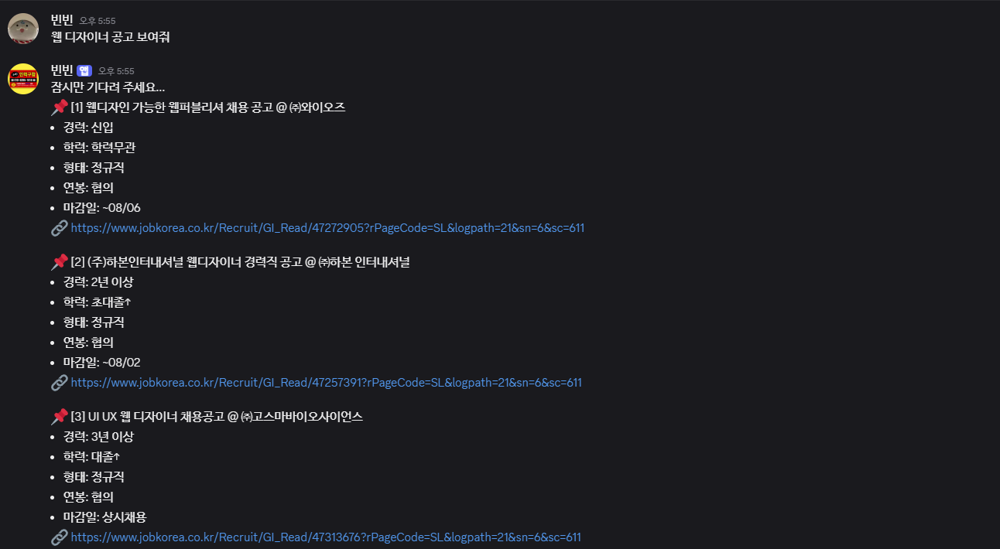
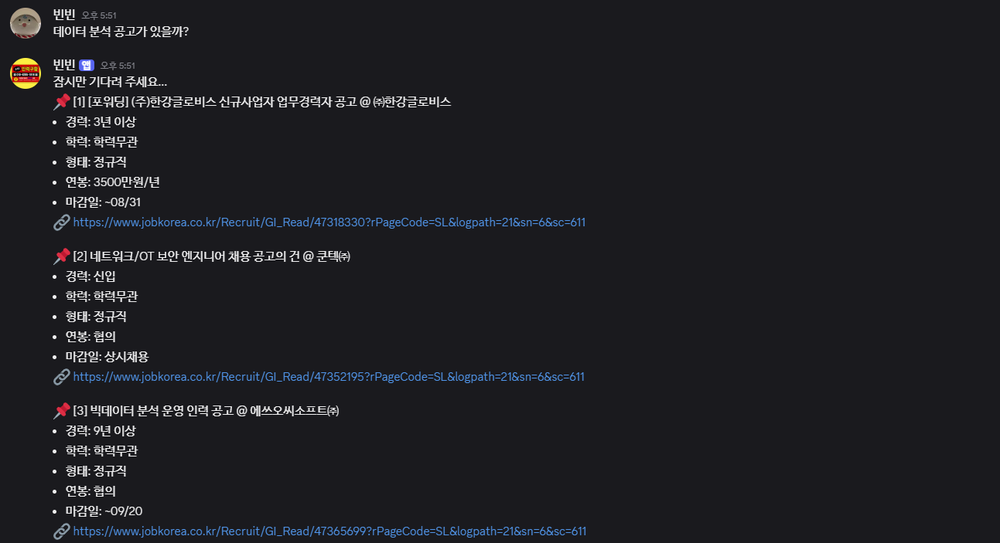

# 💬 채용 공고 검색 디스코드 봇

<div align="center">
  
  
</div>

---

## 📝 요약

채용 공고 데이터를 수집하고, 벡터 DB를 구축하여 **RAG 기반 검색 시스템**을 제공하는 디스코드 봇입니다.  
사용자는 디스코드에서 자연어로 질문을 입력하면, 관련 채용 공고를 추천받을 수 있습니다.

---

## 💡 주요 기능

- Playwright 기반 **크롤링 기능** 구현 (크롤링 코드는 저작권 상의 문제가 있어 비공개하였습니다)
- PostgreSQL을 이용한 **데이터 저장**
- **FAISS + Langchain 기반 RAG 검색 시스템**
- **Local LLM 연동** (ex. Ollama 기반 Mistral 사용)
- **Discord Bot**을 통한 검색 인터페이스 제공
- **Linux 서버 환경에서 SSH + systemd로 운영**

---

## ⚙️ 실행 방법

### 1. `.env` 파일 작성

프로젝트 루트에 `.env` 파일을 생성하고 아래 항목을 설정합니다:

```env
# PostgreSQL 설정
DB_HOST=localhost
DB_PORT=5432
DB_NAME=recruit_db
DB_USER=postgres
DB_PASSWORD=your_password

# 벡터 DB 경로
INDEX_PATH=/home/youruser/vector_index

# Discord Bot 토큰
DISCORD_TOKEN=your_discord_token

# CSV 저장 경로
RECRUIT_CSV_PATH=/home/youruser/jobkorea_data.csv
