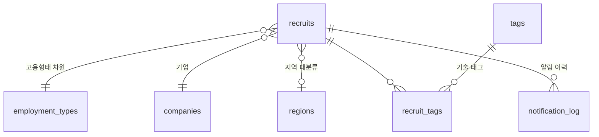

# 채용 공고 검색 디스코드 봇


잡코리아 채용 공고를 매일 자동 수집하고, 디스코드에서 자연어로 검색하거나 관심 조건을 구독해두면 신규 공고를 DM으로 받을 수 있는 봇입니다.
LLM(EXAONE 3.5 7.8B)을 활용한 시맨틱 태깅, 키워드 확장, 재순위를 적용하고 TREC-style 평가 프레임워크로 효과를 정량 측정했습니다.

---

## 주요 기능

- **자연어 검색** — `서울 백엔드 정규직 신입 공고` 형태의 구어체 쿼리를 정규식으로 파싱해 SQL WHERE 절로 변환
- **LLM 키워드 확장** — 검색 키워드를 동의어·기술 스택으로 확장 (`프론트 엔지니어` → `프론트엔드`, `React`, `Vue` 등), TREC 평가 결과 유의미한 품질 변화 없음
- **LLM 재순위** — 검색 후보를 관련도 순으로 재정렬, TREC 평가 결과 유의미한 품질 변화 없음
- **LLM 시맨틱 태깅** — 크롤링 시 공고명 기반으로 직무·기술 태그를 자동 생성, 공고명에 없는 키워드로도 검색 가능
- **채용 시장 분석** — 인기 기술 스택·평균 연봉·지역 분포를 `!인사이트` 명령어로 즉시 조회, 일별 스냅샷 저장
- **구독 알림** — 키워드·지역·경력·연봉 조건을 등록해두면 24시간마다 신규 공고를 DM으로 수신
- **데이터 품질 관리** — 수집 시점에 이상값을 차단하고 `data_quality_log` 테이블에 이력 기록
- **AND/OR 폴백·동의어 사전** — AND 검색 결과 없으면 자동 OR 폴백, `FE → 프론트엔드` 치환

---

## 아키텍처

```
[잡코리아]
    │  Playwright 크롤링 (cron, 매일 06시)
    ▼
[EXAONE 3.5 7.8B via Ollama]  ← 시맨틱 태그 자동 생성
    │
    ▼
[PostgreSQL]
  ── Fact ──────────────────────────────────────────────
  ├─ recruits            공고 (경력/고용형태/연봉/마감일)
  ── Dimension ─────────────────────────────────────────
  ├─ employment_types    고용형태 차원 (정규직/계약직/인턴 등 10종)
  ├─ companies           기업명
  ├─ regions             지역 대분류
  ├─ subregions          지역 소분류 (구·군)
  ├─ tags                기술스택 + LLM 생성 시맨틱 태그
  ── User ──────────────────────────────────────────────
  ├─ user_profiles       사용자 공통 필터 (지역/형태/경력/연봉)
  ├─ user_subscriptions  키워드 구독
  ├─ notification_log    알림 발송 이력
  ── Analytics & Quality ───────────────────────────────
  ├─ job_market_daily    날짜별 채용 시장 스냅샷
  └─ data_quality_log    파싱 이상값 이력
    │
    └─ [Discord Bot]
         ├─ 자연어 검색  →  extract_filters() → 키워드 확장 → SQL → 재순위
         ├─ 구독 등록/해제 (드롭다운 UI)
         └─ 정기 알림 (24h) → 키워드 확장 → 매칭 → 재순위 → DM 발송
```

### 검색 흐름

```
사용자 입력: "서울 프론트 엔지니어 신입 공고"
        │
        ▼
extract_filters()           정규식 기반 파싱
  { region: "서울", keyword: "프론트엔드", max_experience: 0 }
        │
        ▼
expand_keyword()            EXAONE LLM 키워드 확장
  ["프론트엔드", "frontend", "React", "Vue", "UI개발", ...]
        │
        ▼
search_recruits_by_filter() OR 매칭으로 후보 50건 검색
        │
        ▼
rerank()                    EXAONE LLM 관련도 재순위
        │
        ▼
Discord 메시지 반환 (상위 5건)
```

### 구독 알림 흐름

```
24h 백그라운드 태스크
        │
        ▼
get_new_recruits()          최근 24시간 신규 공고 조회
        │
        ▼
expand_keyword()            구독 키워드 LLM 확장
        │
        ▼
_match()                    확장 키워드 OR 매칭 + 프로필 필터
        │
        ▼
rerank()                    LLM 관련도 재순위
        │
        ▼
DM 발송 (상위 10건)
```

---

## 주요 기술 결정

| 결정 | 이유 |
|------|------|
| Playwright (Selenium 대체) | 봇 탐지 우회를 위해 브라우저 레벨 직접 제어 필요 |
| 정규식 필터 추출 (LLM 제거) | 필터 대부분이 정형 패턴 — LLM 대비 응답 ms, 결정론적 |
| FAISS 벡터 검색 제거 | 공고 데이터가 키워드 목록 형식 → 시맨틱 임베딩 효과 낮음, 730MB 상시 점유 |
| PostgreSQL SQL 검색 | 지역/경력/연봉/형태는 정형 컬럼 → WHERE 절이 벡터 거리보다 정확 |
| EXAONE 3.5 7.8B (gemma3:4b, qwen2.5:7b 비교 후 선정) | 한국어 태깅 품질 우수, 지시 준수 안정적 |
| AND → OR 폴백 | 복합 키워드 검색 시 결과 0건 방지 |
| pg_trgm GIN 인덱스 | `announcement_name ILIKE` 검색을 Seq Scan → Bitmap Index Scan으로 개선 |
| `employment_types` 차원 테이블 분리 | `recruits.form` 정수 코드를 명시적 차원 테이블로 분리해 고용형태 기반 다차원 집계 용이 |
| `recruits.region_id` 직접 참조 + 트리거 | 지역 필터 조인을 2단계(subregion→region)에서 1단계로 단순화, 트리거(`trg_sync_region_id`)로 `subregion_id` 변경 시 `region_id` 자동 동기화해 정합성 보장 |

> 의사결정 과정의 상세 배경과 트러블슈팅은 [TROUBLE_SHOOT.md](TROUBLE_SHOOT.md)에 기록되어 있습니다.

---

## 데이터베이스 스키마


```mermaid
erDiagram
    recruits }o--|| employment_types : "고용형태 차원"
    recruits }o--|| companies : "기업"
    recruits }o--o| regions : "지역 대분류"
    recruits ||--o{ recruit_tags : ""
    tags ||--o{ recruit_tags : "기술 태그"
    recruits ||--o{ notification_log : "알림 이력"
```

> 테이블·컬럼 상세는 [PORTFOLIO.md](PORTFOLIO.md#database-schema)를 참고하세요.

---

## 디스코드 명령어

| 명령어 | 설명 |
|--------|------|
| `!도움` | 명령어 목록 |
| `!구독` | 필터(지역/형태/경력/연봉) + 키워드 등록 |
| `!내구독` | 현재 구독 조건 확인 |
| `!구독해제 <번호>` | 특정 키워드 구독 해제 |
| `!구독해제 전체` | 모든 구독 해제 |
| `!알림테스트` | 즉시 알림 조건 확인 및 DM 발송 |
| `!인사이트` | 채용 시장 현황 (인기 스택·연봉·지역·경력 분포) |
| 자연어 입력 | 공고 검색 (예: `서울 백엔드 정규직 신입`) |

---

## 설치 및 실행

### 1. 의존성 설치

```bash
pip install -r requirements.txt
playwright install chromium
```

### 2. `.env` 파일 작성

```bash
cp .env.example .env
```

| 변수 | 설명 |
|------|------|
| `POSTGRES_HOST` | PostgreSQL 호스트 |
| `POSTGRES_PORT` | PostgreSQL 포트 (기본 5432) |
| `POSTGRES_DB` | 데이터베이스 이름 |
| `POSTGRES_USER` | 사용자 |
| `POSTGRES_PASSWORD` | 비밀번호 |
| `DISCORD_BOT_TOKEN` | 디스코드 봇 토큰 |
| `TARGET_URL` | 크롤링 대상 URL |
| `CRAWL_LOG_DIR` | 크롤링 로그 저장 경로 |

### 3. Ollama 설정 (LLM 기능)

LLM 기반 태깅·키워드 확장·재순위 기능은 Ollama가 필요합니다.

```bash
# LAN 내 다른 기기에서도 접속 가능하도록 바인딩
OLLAMA_HOST=0.0.0.0 ollama serve

# EXAONE 3.5 7.8B 모델 다운로드
ollama pull exaone3.5:7.8b
```

`db/tagger.py`, `discord_bot/keyword_expander.py`, `discord_bot/reranker.py` 내 `OLLAMA_URL`을 실제 호스트로 수정합니다.

> Ollama 서버가 꺼져 있어도 크롤링·검색·알림의 기본 기능은 정상 동작합니다. LLM 호출만 건너뜁니다.

### 4. 크롤링 실행

```bash
python main.py              # 최근 1일치 수집 (기본) + LLM 태깅 자동 실행
python main.py --days 7     # 최근 N일치 수집
python main.py --fresh      # 기존 데이터 전체 삭제 후 재수집
```

기존 공고 소급 태깅:

```bash
python db/tag_recruits.py                    # 마감 유효 공고 전체
python db/tag_recruits.py --date 2026-03-14  # 특정 수집일만
```

### 5. 디스코드 봇 실행

```bash
python -m discord_bot.bot
```

### 6. 분석 스냅샷 수동 실행

크롤링 완료 후 `main.py`에서 자동 실행되지만, 단독으로도 실행 가능합니다.

```bash
python analytics/snapshot.py                    # 오늘 날짜 스냅샷
python analytics/snapshot.py --date 2026-03-14  # 특정 날짜 재생성
```

### 7. cron 자동화

```bash
# 매일 06시 크롤링 + LLM 태깅 + 분석 스냅샷
0 6 * * * cd /path/to/job_search_bot && python main.py
```

---

## 테스트

```bash
# 단위 테스트 (DB 불필요 — extract_filters 파싱 로직)
python -m pytest tests/ -v

# 통합 테스트 (실 DB 필요 — SQL 검색 결과 50케이스)
python tests/test_search.py

# 스냅샷 갱신 (extract_filters 수정 후 기준선 재설정)
python tests/test_search.py --update-snapshot

# 관련도 판정 구조 검증 (DB 불필요 — 43개 쿼리 × 판정 데이터 형식·일관성)
python -m pytest tests/test_relevance_judgments.py::TestJudgmentStructure -v

# 관련도 판정 검색 품질 테스트 (실 DB 필요 — 판정 데이터 × 실제 검색 결과 비교)
python -m pytest tests/test_relevance_judgments.py --db -v
```

판정 데이터(`tests/write_judgments.py`)는 A·B·C·D 4개 시리즈 43개 쿼리에 대해 수동으로 작성한 공고별 관련도(0~3점) 기록입니다. D 시리즈 및 일부 B 시리즈는 검색 시스템의 한계를 확인하는 엣지케이스입니다.
